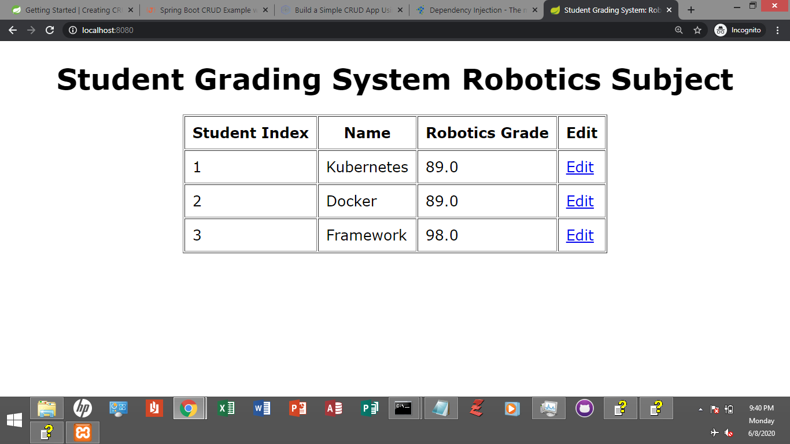

# Grading System through Spring Boot

*`updated 21 April 2022`*

[](https://hits.seeyoufarm.com)



In this Spring Boot project, I used JPA for persistence, MySQL being the 
database.

Take note, when Spring Boot (Hibernate actually) maps the java 
class into the database, the naming convention is critical, for example:

`roboticsGrade` will be mapped in the database column as
`robotics_grade`.

Now, you might not notice this when you have `create-drop` setting
in `spring.jpa.hibernate.ddl-auto` because
Spring Boot automatically solves the issue.
The `create-drop` always creates a fresh environment setup and
solves conflicts between Java classes and MySQL.
But when you want the persistent
database record, you must set it to `none`. 

`application.properties`:
```
spring.jpa.properties.hibernate.jdbc.time_zone=UTC
spring.jpa.hibernate.ddl-auto=none
spring.jpa.open-in-view=true
spring.datasource.url=jdbc:mysql://localhost:3306/gradingSystem?serverTimezone=UTC&useLegacyDatetimeCode=false
spring.datasource.username=root
spring.datasource.password=
logging.level.root=WARN
```

As you can see in the application properties, for this project to work, make sure
you have MySQL installed in your computer with `gradingSystem` database and
`student` table with initial data, at least the name of the student. There are 
three columns you must satisfy, `id`, `name`, `robotics_grade`. `id` is
the primary key with auto-increment.

Now, the time zone was configured twice, first in JDBC and second, in server env.
Without these settings, errors may occur.

Remember, the Spring Framework is great already. The Spring Boot takes that to another
level of abstraction.	

## Q&A

If you have questions, please utilize
the `Discussions` feature of GitHub.
   
You can also create a pull request or raise
an issue to start the discussion or query/ies.

## Compile, Build & Run
Before you compile and build, make sure you are at the project directory
`SpringBootProjectDir`. Take note also, I'm using Maven build tool here. 

In Windows,

to package your program as an executable jar file:

	mvn clean package

to simply clean and compile:

	mvn clean compile

to just clean your project:

	mvn clean

to run the program:

	mvn spring-boot:run

to build and run the program:

	mvn clean install


## Contributing

1. Fork it!
2. Then, made changes, and create a pull request. 
I'm much more willing to collaborate with you!

## License

MIT - the permissive license
